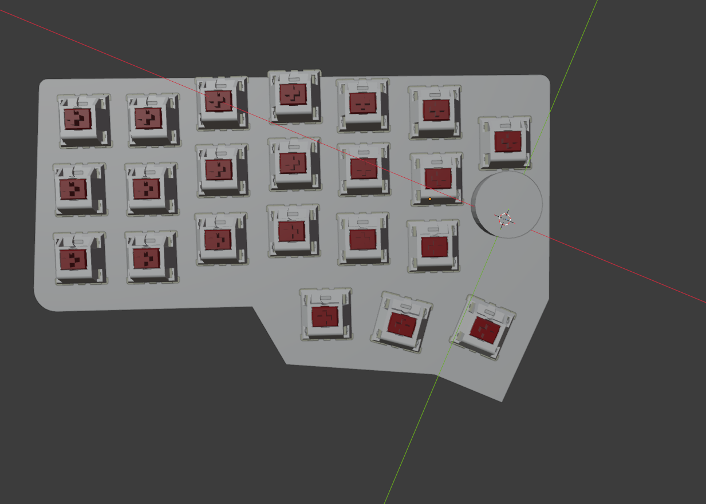
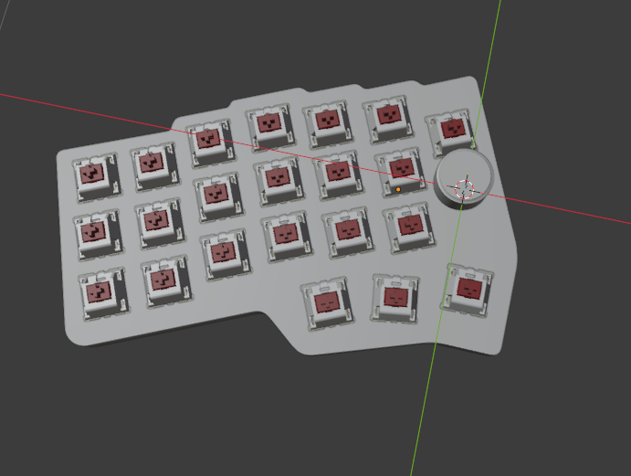
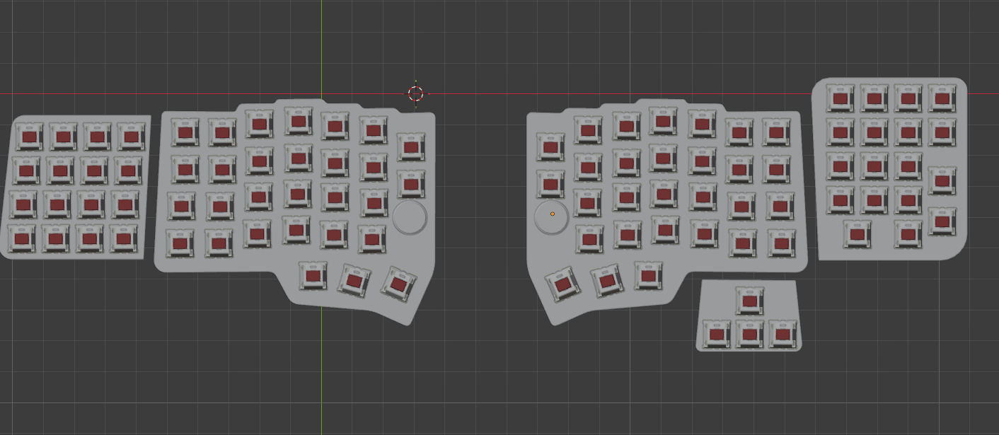
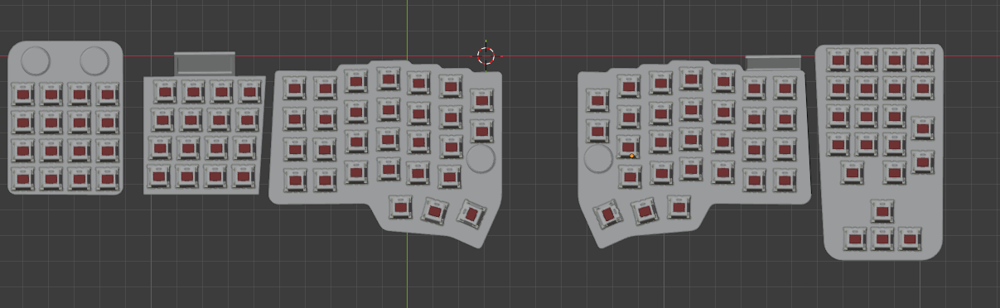
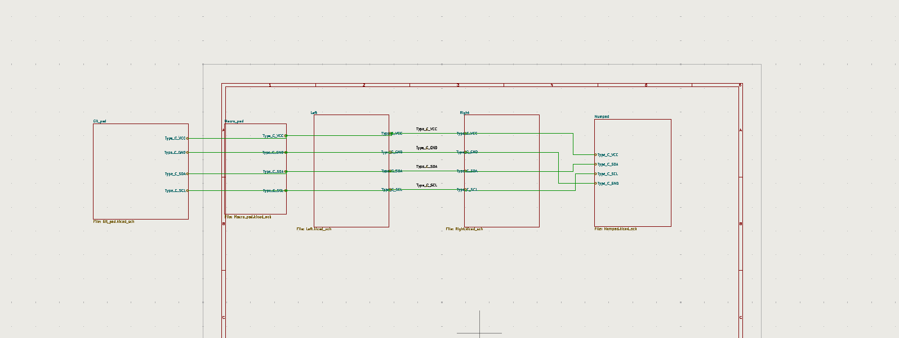
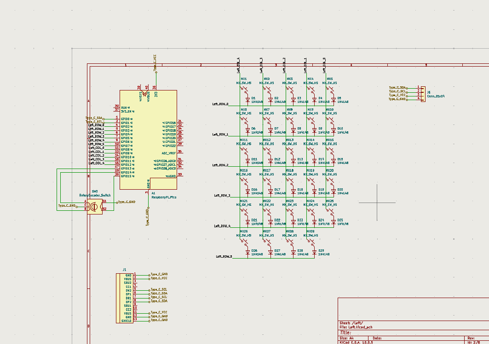

# custom_keyboard
August 3: I have been searching about how keayboards work. And how matrix system works. Spend a total of 1 hour investigating and watching videos about how to keyboards work and how to create one. Here are the links: 
-https://www.youtube.com/watch?v=8WXpGTIbxlQ
-https://www.youtube.com/watch?v=7LyziNdFlew
-https://www.youtube.com/watch?v=h-NM1xSSzHQ

August 4: I created the github repo. 
August 14:
-2:10AM-3AM: Planning my keyboard. 
-10PM-12AM: I kept planning and making a 3D model to get an idea about how the keyboard should look like.

August 15:
-12AM-3AM: I finished the main model. 
-3AM-4:40AM: I tought that I could add more things so I made the keyboard bigger. And also added attachable parts. 
-4:40AM-6AM: I planned where everything will go. Searched about how to make the keyboard hotswappable. I had a problem and it is that the keyboard has 96 keys and 2 knobs. The pi pico doesnt have enough pins. I had two main options, use 2 pi picos or use a another chip. But after inverstigating I found ot a way to make it work with a single pi pico. 
-2PM-4PM: I added an oled screen, installed kicad. And also searched about ways to connect the keyboard with magnets. I found out about pogo pins. And I decided using them.
-11:20PM-12AM: I searched about encoreds and searched about how a MCP23017 works and how to use it. I also watched this video about it 
August 16:
-8PM-11PM: I started designing the pcb.
August 17: 
-7:30PM-11PM: I continued with the PCB, I accidentally forgot to save the right part the day before and had to redo that. I also started organizsing thingsa and connect the two main parts. I also search about mousebites. And I decided to use it since the keybaord will be split in multiple parts.
August 18"
-2:30PM-3:30PM: I made some changes to the keyboard model. 
-11PM-12AM: I continued with the pcb
August 19:
-12AM-3AM: I kept doing the pcb, and finished the connections. I tried to use schematic hiererchy to organize it all. I hope I didnt mess it up. Here are some photos.  
-3AM-7AM: I fixed all the errors that didnt let me start the design of the PCB
-10PM-12AM: I run the ERC and got 74 errors. And I spend the time fixing them.
