# my-kkeb

A 113-key modular mechanical keyboard, split into 5 boards that connect with magnetic pogo pins. It is designed in KiCad (PCB) and Fusion (case) for Hack Club's KEEB program.

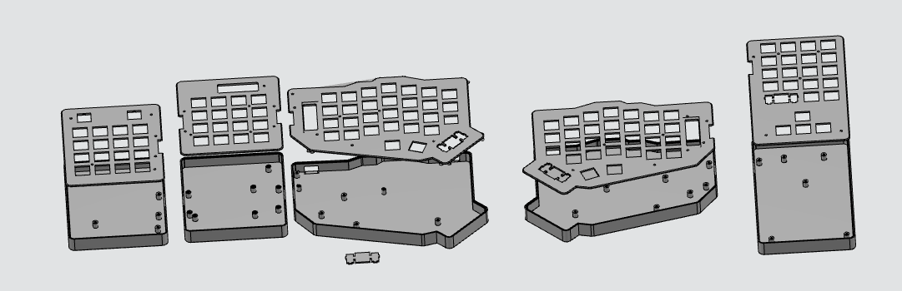

## Why I built it
I build this because I was interested in split keyboard. I really like how they look but I dont like how they sacrifice a lot of keys and thats makes them difficult to use for some things. So I had the idea to make a modular split keyboard. 
## How it works
The way it works it pretty simple. A pi pico powers it all. I used mcp23017 chips so I could get enough pins for all the matrix rows and colums from just transfering 4 pins thought the modules.
## Repository layout

```
my-kkeb/                 KiCad project (schematics + PCB)
  CUSTOM.pretty/         custom footprints (pogo connector, hot-swap socket, USB-C)
  export/fab/            Gerber zips, one per board, ready for JLCPCB
case/
  <Module>/Case_*.step   case for each module (one body per file for printing)
  <Module>/Plate_*.step  switch plate for each module
  my-kkeb-case-assembly.step   everything together, for viewing only
```

## Building it

1. **PCBs:** upload each zip from `my-kkeb/export/fab/` to JLCPCB as a separate order (5 boards).
2. **Case:** print the `Case_*` and `Plate_*` files from `case/`. I plan to use JLC3DP in black resin.
3. **Parts:** see `bom.csv`
4. **Firmware:** not done yet

## What I learned
I learned a lot of stuff. I learn a lot about how keyboard work. What I think that is the most valuable thing about what I learned is the knowladge about PCBs, I knew some stuff but I have never tried to actually make a PCB before. And it was actually harder than I thought for some things. But overall I enjoyed a lot doing everything. Making the case was definetely harder than doing the PCB, because I didnt really know how to make the it at first. I tried using FreeCad at first since fusion wasnt in linux, and I didnt liked onshape. But I ended up intalling fusion in my windows and Did 95% of they case there and a did some changed on freecad late on.

## Build journal

**Total: 80 hours**

| Date | Hours | What I worked on |
|---|---|---|
| August 3 | 1 h | Research |
| August 4 | – | GitHub repo |
| August 14 | 2 h 50 min | Planning and first 3D model |
| August 15 | 8 h 40 min | Main model, planning, OLED, pogo pins, MCP23017 |
| August 16 | 3 h | PCB |
| August 17 | 3 h 30 min | PCB |
| August 18 | 2 h | Model changes, PCB |
| August 19 | 9 h | Schematic, ERC |
| August 20 | 7 h | PCB placement |
| August 21 | 16 h | PCB placement and wiring |
| August 23 | 4 h | Wiring |
| August 28 | 6 h | Case |
| September 13 | 7 h | Case, rewiring |
| September 20 | 3 h | Case |
| September 25 | 7 h | Case |

### August 3 (1 h)
I have been searching about how keayboards work. And how matrix system works. Spend a total of 1 hour investigating and watching videos about how to keyboards work and how to create one. Here are the links:
- https://www.youtube.com/watch?v=8WXpGTIbxlQ
- https://www.youtube.com/watch?v=7LyziNdFlew
- https://www.youtube.com/watch?v=h-NM1xSSzHQ

### August 4
I created the github repo.

### August 14 (2 h 50 min)
- **2:10AM-3AM:** Planning my keyboard.
- **10PM-12AM:** I kept planning and making a 3D model to get an idea about how the keyboard should look like.

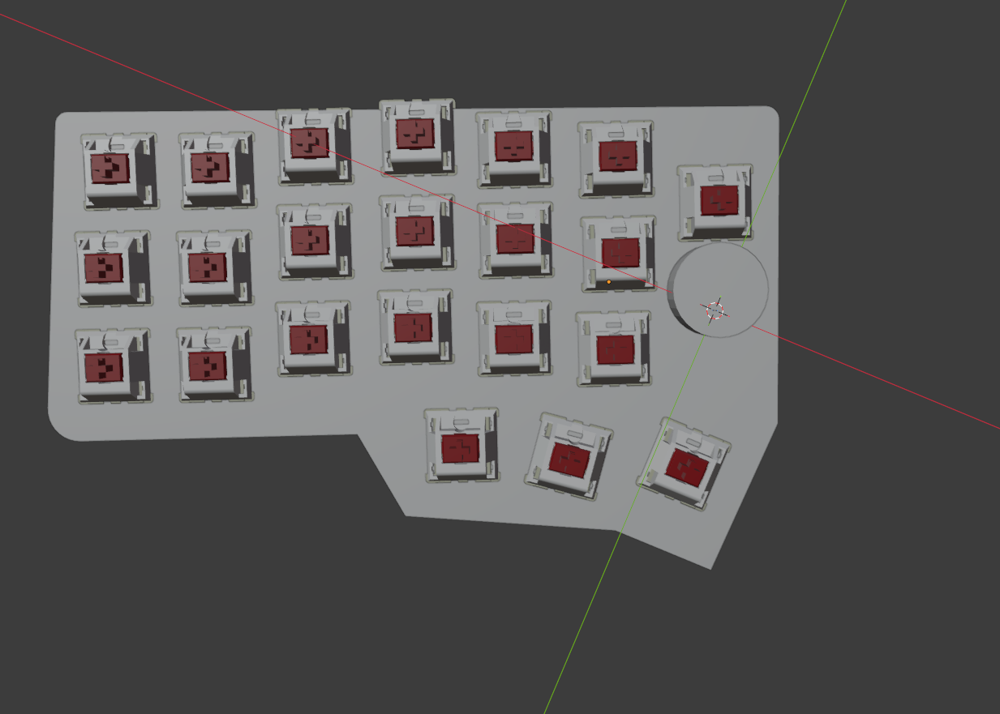

### August 15 (8 h 40 min)
- **12AM-3AM:** I finished the main model.

  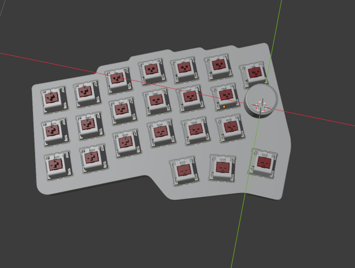
- **3AM-4:40AM:** I tought that I could add more things so I made the keyboard bigger. And also added attachable parts.

  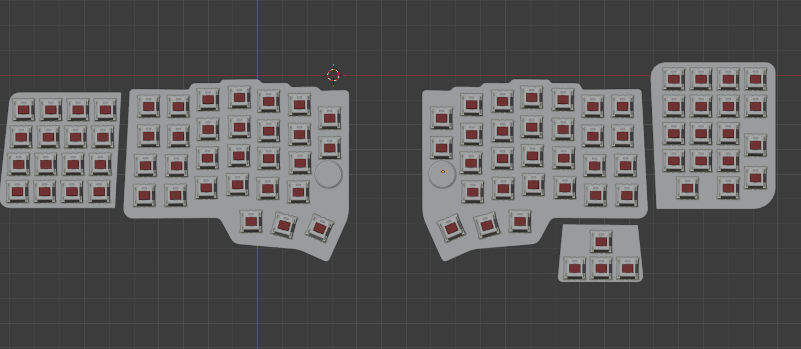
- **4:40AM-6AM:** I planned where everything will go. Searched about how to make the keyboard hotswappable. I had a problem and it is that the keyboard has 96 keys and 2 knobs. The pi pico doesnt have enough pins. I had two main options, use 2 pi picos or use a another chip. But after inverstigating I found ot a way to make it work with a single pi pico.
- **2PM-4PM:** I added an oled screen, installed kicad. And also searched about ways to connect the keyboard with magnets. I found out about pogo pins. And I decided using them.
- **11:20PM-12AM:** I searched about encoreds and searched about how a MCP23017 works and how to use it. I also watched this video about it

### August 16 (3 h)
- **12:20AM-1:50AM:** I created the kicad project and started adding the base thing like the swithes and the pi pico
- **8PM-11PM:** I started designing the pcb.
  - **8:15PM-9PM:** At this point i had the matrix of the right and left part, but it wasnt wired yet.

### August 17 (3 h 30 min)
- **12:30AM-1:40AM:** kept drawing the switch matrix: D30-D58 and their switches
- **3:20AM-3:50AM:** moved the whole matrix out of the main sheet into its own sheet called `left_part` and started using hierarchical schematic since it was for my case. I couldnt find much info online, but I managed to make it work
- **7:30PM-11PM:** I continued with the PCB, I accidentally forgot to save the right part the day before and had to redo that. I also started organizsing thingsa and connect the two main parts. I also search about mousebites. And I decided to use it since the keybaord will be split in multiple parts.

### August 18 (2 h)
- **4AM-4:10AM:** split `left_part` into two sheets, **Left** and **Right** (60 symbols each), and made an empty numpad sheet
- **2:30PM-3:30PM:** I made some changes to the keyboard model.

  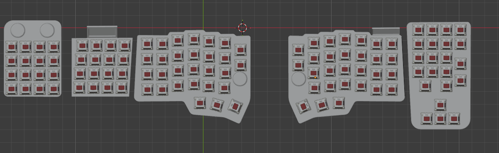
- **3PM-3:50PM:** filled the **Numpad** sheet: switches, diodes D59-D80 and its connector J3. Added SW2 to the Left sheet
- **11PM-12AM:** I continued with the pcb

### August 19 (9 h)
- **12AM-3AM:** I kept doing the pcb, and finished the connections. I tried to use schematic hiererchy to organize it all. I hope I didnt mess it up. In this period I basically added the Macro pad and the git pad. Here are some photos:
  - **12AM-1AM:** made the **Macro_pad** sheet (diodes D81-D96, connectors J5, J7, J8) and an empty Git_pad sheet
  - **2:25AM-3AM:** filled the **Git_pad** sheet (diodes D97-D112, connector J9)

  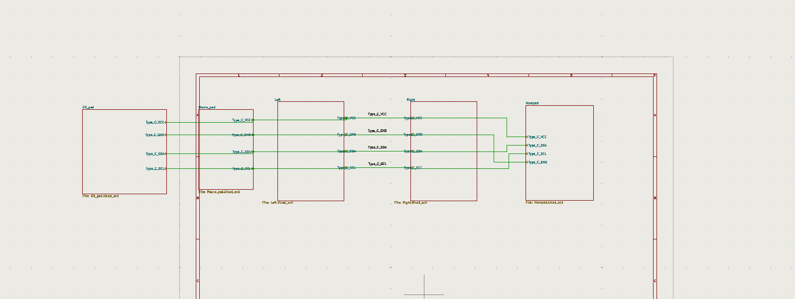
  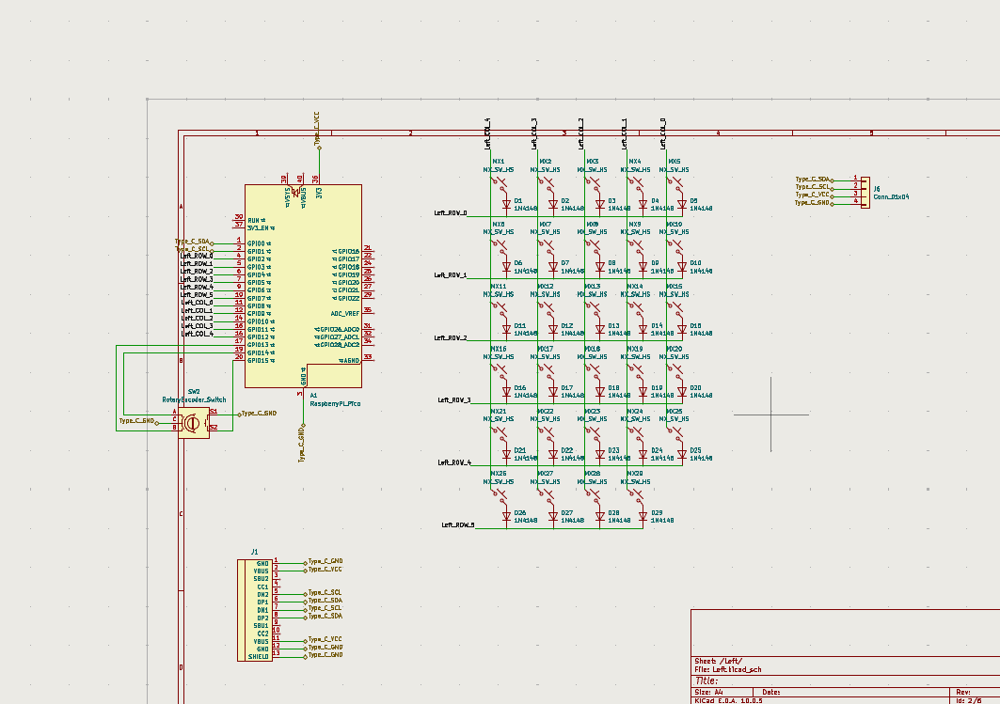
- **3AM-7AM:** I fixed all the errors that didnt let me start the design of the PCB
  - **4:45AM-6:35AM:** first time the schematic was sent to the PCB editor: **247 footprints** appeared on the board. Replaced the old J1/J2 connectors with the two USB-C ports (J5 and J11)
- **10PM-12AM:** I run the ERC and got 74 errors. And I spend the time fixing them.
  - **11PM-11:40PM:** added labels on the Git_pad, Macro_pad, Numpad and Right sheets (the ERC fixing)

### August 20 (7 h)
- **12AM-5AM:** I started designing the PCB completed positioning the two main parts of the keybaord and also added the diodes to the left half. Here is a photo:
  - **12:45AM-4:50AM:** placed all 112 switches and the first 29 diodes on the Left board, and moved 31 parts to the back side. Removed an extra connector (J10)

  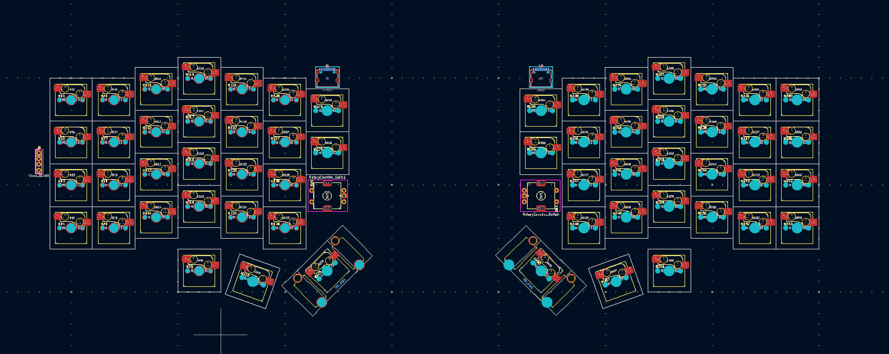
- **10PM-12AM:** I continued with the PCB placement
  - **11PM-2:40AM:** placed all 112 diodes, the rest of the switches, the chips and the connectors (246 parts moved). Added the 113th key (MX113 and D113) to the Numpad

*(Postdata: I messed up really bad here, because I thought that the kailh sockets had to go on the front of the plate, I had to fix that late one)*

### August 21 (16 h)
- **12AM-5AM:** I finished the placement of the compenents in the PCB
- **10PM-12AM:** I continued started wiring the components
- **12AM-9AM:** I finished the wiring of the right part, left part. And the numpad.
  - **4:20AM-5:50AM:** first wiring: 553 track pieces and 87 vias
  - **7:15AM-9AM:** kept wigin and got up to **1,987 track pieces and 247 vias**

  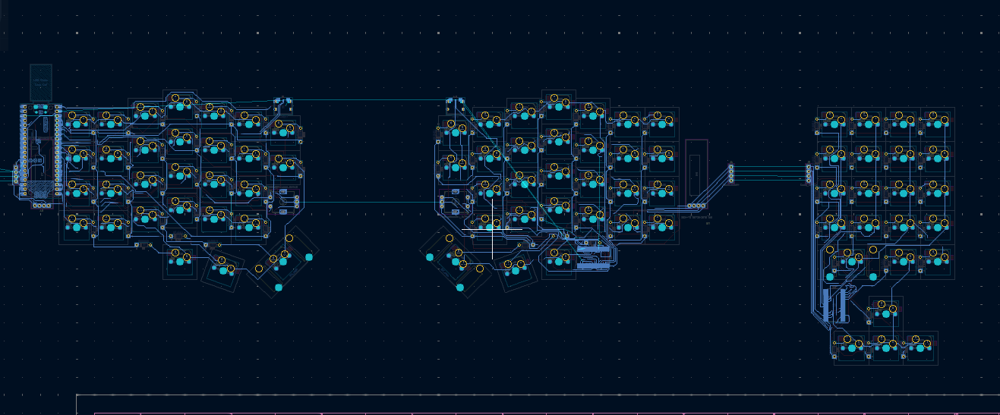

### August 23 (4 h)
- **12AM-4AM:** I finished wiring all the keybaord.
  - **1:20AM-5AM:** kept wiring and got from 1,987 to 2,514 track pieces, 324 vias
- **7:45PM-8:10PM:** restored a backup from KiCad's history, then kept wiring
- **9:45PM-10:30PM:** more wiring, up to **2,798 track pieces and 361 vias**

### August 24
- **2:30AM-3:30AM:** I added some ressistors and capacitators.

### August 28 (6 h)
- **12AM-6AM:** I started designing the case

### August 31
- **1:20AM-6:30AM:** I hadded mountholes to the pcb. Run DRC again, got a bunch of problems I solved the,

### September 13 (7 h)
- **12AM-2AM:** I kept designing the case
- **2AM-7AM:** I noticed that I had the kailh hotswap sockets in the wrong side of the board, so I had to basically rewire everything.

### September 20 (3 h)
- **3PM-6PM:** I kept designing everything, and finished the numpad.

### September 25 (7 h)
- **11AM-6PM:** I finished the full case, and seperated it into different files. Here are some photos:

  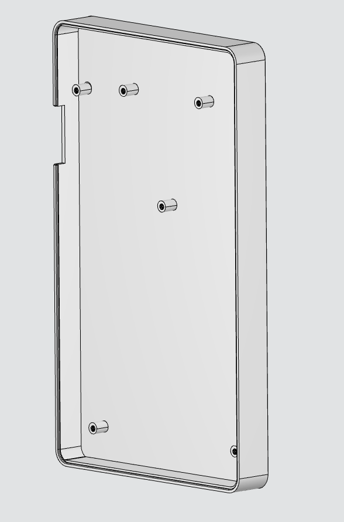
  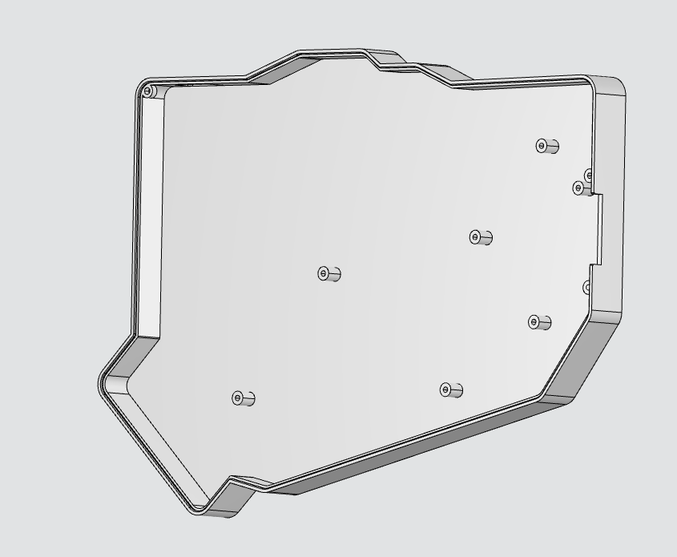
  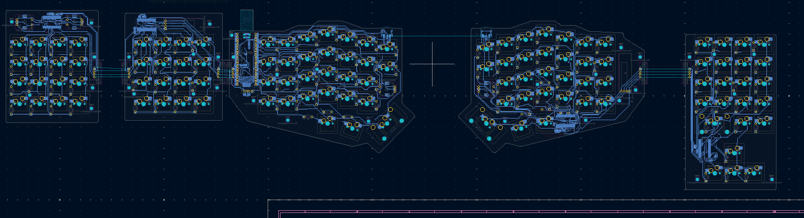
